# Relatório de Análise (Atividade de Code Review em Repositórios Populares do GitHub)

**Disciplina**: Experimentação de Software  
**Instituição**: PUCMINAS  
**Período**: 01/2026  
**Autores**: Augusto Fuscaldi e Filipe Faria

---

## 1. Introdução

### 1.1 Contextualização

A prática de code review tornou-se uma constante nos processos de desenvolvimento ágil. Em repositórios open source hospedados no GitHub, as revisões ocorrem principalmente via Pull Requests (PRs): um autor submete mudanças, revisores inspecionam o código e, após discussão, o PR pode ser aceito (merged) ou fechado (closed).

Este trabalho investiga a atividade de code review em repositórios populares do GitHub, buscando identificar quais variáveis de um PR (tamanho, tempo de análise, descrição, interações) se relacionam com o feedback final (merge vs closed) e com o número de revisões realizadas.

### 1.2 Problema Foco do Experimento

Nos processos colaborativos de projetos open source surge a seguinte questão empírica: quais características de um Pull Request influenciam seu resultado final (merge vs closed) e a intensidade do processo de revisão (número de revisões)? Em outras palavras, PRs maiores, mais antigos, com descrições melhores ou com mais discussões tendem a ser aceitos com mais frequência ou a sofrerem mais revisões?

Este estudo busca responder essas perguntas analisando PRs submetidos a repositórios populares do GitHub, usando como base o pipeline implementado em `trab-3`.

### 1.3 Questões de Pesquisa

As questões de pesquisa seguem duas dimensões (Feedback Final e Número de Revisões):

A. Feedback Final das Revisões (Status do PR)

- **RQ01**: Qual a relação entre o **tamanho** dos PRs e o feedback final das revisões (merge vs closed)?
- **RQ02**: Qual a relação entre o **tempo de análise** dos PRs e o feedback final das revisões?
- **RQ03**: Qual a relação entre a **descrição** dos PRs e o feedback final das revisões?
- **RQ04**: Qual a relação entre as **interações** nos PRs (comentários, participantes) e o feedback final das revisões?

B. Número de Revisões

- **RQ05**: Qual a relação entre o **tamanho** dos PRs e o número de revisões realizadas?
- **RQ06**: Qual a relação entre o **tempo de análise** dos PRs e o número de revisões realizadas?
- **RQ07**: Qual a relação entre a **descrição** dos PRs e o número de revisões realizadas?
- **RQ08**: Qual a relação entre as **interações** nos PRs e o número de revisões realizadas?

### 1.4 Definição de Métricas

As métricas calculadas para cada PR e utilizadas nas análises são:

| Dimensão         | Métrica / Proxy                                                                                                                     |
| ---------------- | ----------------------------------------------------------------------------------------------------------------------------------- |
| Tamanho          | Número de arquivos modificados (`changedFiles`), adições (`additions`), remoções (`deletions`), `total_changes`                     |
| Tempo de Análise | Intervalo entre `createdAt` e `mergedAt`/`closedAt` (horas, armazenado em `time_to_close_hours`)                                    |
| Descrição        | Número de caracteres do corpo do PR (`body_length`)                                                                                 |
| Interações       | Número de revisões (`reviews.totalCount`), número de participantes (`participants.totalCount`), comentários (`comments.totalCount`) |
| Feedback Final   | Estado final do PR (`state`): `MERGED` ou `CLOSED`                                                                                  |

Esses campos são extraídos diretamente da query GraphQL implementada em `github_utils.py` (campo `pullRequests.nodes`), e o pipeline de `collect_prs.py` aplica os filtros: PRs com `reviews.totalCount` < 1 são descartados; PRs com tempo de análise ≤ 1 hora são descartados (provável revisão automática). O arquivo de saída padrão do pipeline é `prs_coletados.csv`, com cabeçalho compatível com as chaves acima.

### 1.5 Hipóteses

Formulam-se hipóteses informais a serem testadas com o dataset agregado (medianas dos PRs):

- **H1 (RQ01)**: PRs maiores (mais arquivos/linhas alteradas) tendem a ter menor probabilidade de serem aceitos (merge), pois são mais complexos e difíceis de revisar, com mais chance de possuir bugs.
- **H2 (RQ02)**: PRs com maior tempo de análise tendem a ter menor probabilidade de merge (tempo longos podem indicar problemas, conflitos ou necessidade de mudanças substanciais).
- **H3 (RQ03)**: PRs com descrições mais detalhadas (maior `body_length`) tendem a ter maior probabilidade de merge, pois facilitam a avaliação pelos revisores.
- **H4 (RQ04)**: PRs com maior número de interações (comentários, participantes) tendem a ter menor taxa de merge inicial (discussões indicam controvérsia), mas podem evoluir para merge após iterações.

- **H5 (RQ05)**: PRs maiores exigem mais revisões (maior `reviews.totalCount`).
- **H6 (RQ06)**: PRs com maior tempo de análise tendem a acumular mais revisões.
- **H7 (RQ07)**: PRs com descrições mais ricas tendem a exigir menos revisões (descrição clara reduz idas e vindas).
- **H8 (RQ08)**: PRs com mais interações correlacionam-se positivamente com o número de revisões (discussões prolongadas aumentam o número de revisões registradas).

### 1.6 Objetivos

**Objetivo Principal**: Investigar empiricamente quais características de Pull Requests influenciam o feedback final (merge vs closed) e o número de revisões em repositórios populares do GitHub.

**Objetivos Específicos**:

- Selecionar repositórios populares usando `collect_repos.py` (padrão: 200 repositórios com ≥ 100 PRs Merged+Closed).
- Coletar PRs dos repositórios selecionados usando `collect_prs.py`, aplicando filtros: PRs com estado MERGED/CLOSED, ≥ 1 revisão, tempo de análise > 1 hora.
- Construir o dataset `prs_coletados.csv` contendo as métricas listadas em 1.4 (`changedFiles`, `additions`, `deletions`, `time_to_close_hours`, `body_length`, `reviews_count`, `participants_count`, `comments_count`, `state`).
- Calcular estatísticas descritivas (medianas) por métrica e executar testes de correlação apropriados entre variáveis explicativas e as respostas (feedback final e número de revisões).

**Decisão sobre teste estatístico**: para as análises de associação será utilizado o coeficiente de correlação de Spearman (ρ), por ser não-paramétrico e robusto a distribuições fortemente enviesadas e outliers (comportamento esperado nas métricas de PR, por exemplo, `additions` e `deletions` costumam ter distribuição assimétrica). Quando aplicável, complementar-se-á com testes de hipótese (p-valor) e análise descritiva baseada em medianas.

**Objetivos Específicos**:
Os scripts disponíveis implementam a pipeline de coleta: `collect_repos.py` seleciona repositórios populares via GraphQL (por padrão, `--target=200` e `--min-prs=100`), `collect_prs.py` percorre cada repositório buscando PRs (padrão `--per-page=50`, concorrência assíncrona `--concurrency=5`) e `github_utils.py` contém as queries GraphQL usadas para obter PRs e repositórios. Os critérios de filtragem adotados no pipeline são consistentes com o objetivo de analisar PRs que passaram por revisão humana: considerar apenas PRs com estado MERGED ou CLOSED, que possuam ao menos uma revisão (`reviews.totalCount >= 1`) e cujo tempo entre criação e fechamento/merge seja maior que 1 hora (evita revisões automáticas/bots).

---

## 2. Metodologia

### 2.1 Visão Geral do Processo

O experimento foi conduzido em cinco etapas sequenciais, descritas a seguir e resumidas no fluxograma abaixo.

```
┌─────────────────────────────────────────────────────────────────────┐
│                      FLUXO DA METODOLOGIA                           │
└─────────────────────────────────────────────────────────────────────┘

  ┌──────────────────┐
  │  1. Planejamento │
  │  Definição de    │
  │  RQs, métricas   │
  │  e hipóteses     │
  └────────┬─────────┘
           │
           ▼
  ┌──────────────────┐
  │  2. Seleção de   │
  │  Repositórios    │
  │  collect_repos.py│
  │  (≥100 PRs,      │
  │   top estrelas)  │
  └────────┬─────────┘
           │
           ▼
  ┌──────────────────┐
  │  3. Coleta de    │
  │  Pull Requests   │
  │  collect_prs.py  │
  │  (GraphQL API,   │
  │   filtros: ≥1    │
  │   review, >1h)   │
  └────────┬─────────┘
           │
           ▼
  ┌──────────────────┐
  │  4. Análise      │
  │  Estatística     │
  │  analyze_prs.py  │
  │  (medianas,      │
  │   Spearman ρ)    │
  └────────┬─────────┘
           │
           ▼
  ┌──────────────────┐
  │  5. Discussão e  │
  │  Conclusão       │
  │  (hipóteses vs   │
  │   resultados)    │
  └──────────────────┘
```

### 2.2 Etapas Detalhadas

**Etapa 1 (Planejamento)**

1. Definição das oito questões de pesquisa (RQ01–RQ08) divididas em dois eixos: feedback final (MERGED/CLOSED) e número de revisões.
2. Identificação das métricas de processo e qualidade de PR a serem coletadas.
3. Formulação de hipóteses informais para cada RQ.

**Etapa 2 (Seleção de Repositórios, `collect_repos.py`)**

1. Autenticação na API GraphQL v4 do GitHub com token pessoal.
2. Query de repositórios com critério de popularidade (por padrão, os mais estrelados), com filtro de ≥ 100 PRs MERGED+CLOSED.
3. Paginação e deduplicação por nome completo do repositório.
4. Exportação para `repos_selecionados.csv`.

**Etapa 3 (Coleta de Pull Requests, `collect_prs.py`)**

1. Para cada repositório selecionado, consulta paginada dos PRs via GraphQL.
2. Extração dos campos: `state`, `createdAt`, `closedAt`/`mergedAt`, `changedFiles`, `additions`, `deletions`, `bodyText`, `reviews.totalCount`, `participants.totalCount`, `comments.totalCount`.
3. Cálculo do `time_to_close_hours` e do `body_length`.
4. Filtros aplicados: apenas PRs MERGED ou CLOSED, com ≥ 1 revisão e tempo de análise > 1 hora (elimina revisões automáticas/bots).
5. Exportação para `prs_coletados.csv`.

**Etapa 4 (Análise Estatística, `analyze_prs.py`)**

1. Cálculo de estatísticas descritivas (mínimo, mediana, média, máximo) para cada métrica numérica.
2. Cálculo das medianas por grupo de estado (MERGED vs CLOSED) para as RQ01–RQ04.
3. Cálculo do coeficiente de correlação de Spearman (ρ) entre variáveis explicativas e o número de revisões (RQ05–RQ08) e o estado final (RQ01–RQ04).
4. Geração de gráficos e tabelas de resumo via GUI `analyze_prs.py`.

**Etapa 5 (Discussão e Conclusão)**

1. Comparação dos resultados obtidos com as hipóteses formuladas.
2. Identificação de padrões, anomalias e limitações do estudo.

### 2.3 Decisão sobre o Teste Estatístico

Para as análises de associação entre variáveis, foi escolhido o **coeficiente de correlação de Spearman (ρ)** pelos seguintes motivos:

- **Não-paramétrico**: não assume distribuição normal nos dados. As métricas de PR (adições, remoções, tempo) apresentam distribuições fortemente assimétricas à direita, violando premissas do coeficiente de Pearson.
- **Robusto a outliers**: como evidenciado pelas médias versus medianas (ex.: média de tempo = 651,7h vs. mediana = 41,6h), há outliers extremos que distorceriam o Pearson.
- **Apropriado para variáveis ordinais/contínuas**: funciona bem tanto para a variável `reviews_count` (discreta) quanto para as métricas contínuas de tamanho e tempo.
- **Interpretação direta do p-valor**: com n = 650.070 PRs, qualquer correlação diferente de zero tem poder estatístico suficiente para rejeitar H₀. O p-valor indica significância; a magnitude de ρ indica relevância prática.

A classificação utilizada para o ρ de Spearman segue a escala:

| \|ρ\|       | Classificação |
| ----------- | ------------- |
| 0,00 – 0,19 | Desprezível   |
| 0,20 – 0,39 | Fraca         |
| 0,40 – 0,59 | Moderada      |
| 0,60 – 0,79 | Forte         |
| 0,80 – 1,00 | Muito forte   |

Para as RQ01–RQ04, onde a variável resposta é binária (MERGED=1 / CLOSED=0), o Spearman mede a associação monotônica entre a métrica explicativa e a probabilidade de merge. Para as RQ05–RQ08, mede a associação com o número de revisões.

### 2.4 Materiais Utilizados

**API**: GitHub GraphQL API v4 (`https://api.github.com/graphql`) com autenticação por token pessoal.

**Linguagem**: Python 3.12

**Bibliotecas**:

- `aiohttp` + `asyncio`: Coleta assíncrona de PRs com concorrência controlada
- `scipy.stats.spearmanr`: Cálculo do coeficiente de Spearman com p-valor
- `tkinter` + `matplotlib` + `numpy`: Interface gráfica e visualizações

**Infraestrutura**: Windows 11, git no PATH.

---

## 3. Resultados

### 3.1 Dataset Coletado

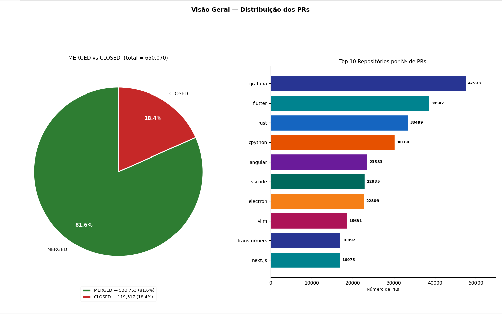

| Métrica                 | Valor           |
| ----------------------- | --------------- |
| Repositórios analisados | 196             |
| Total de PRs coletados  | 650.070         |
| PRs MERGED              | 530.753 (81,6%) |
| PRs CLOSED              | 119.317 (18,4%) |

### 3.2 Estatísticas Descritivas Gerais

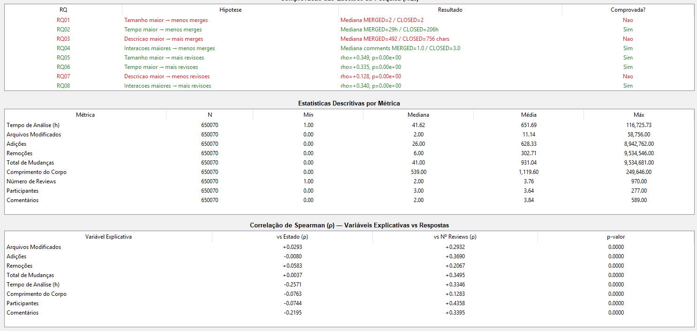

| Métrica                  | N       | Mínimo | Mediana | Média   | Máximo      |
| ------------------------ | ------- | ------ | ------- | ------- | ----------- |
| Tempo de Análise (h)     | 650.070 | 1,0    | 41,6    | 651,7   | 116.725,7   |
| Arquivos Modificados     | 650.070 | 0,0    | 2,0     | 11,1    | 58.756,0    |
| Adições (linhas)         | 650.070 | 0,0    | 26,0    | 628,3   | 8.942.762,0 |
| Remoções (linhas)        | 650.070 | 0,0    | 6,0     | 302,7   | 9.534.546,0 |
| Total de Mudanças        | 650.070 | 0,0    | 41,0    | 931,0   | 9.534.681,0 |
| Comprimento da Descrição | 650.070 | 0,0    | 539,0   | 1.119,6 | 249.646,0   |
| Número de Reviews        | 650.070 | 1,0    | 2,0     | 3,8     | 970,0       |
| Participantes            | 650.070 | 0,0    | 3,0     | 3,6     | 277,0       |
| Comentários              | 650.070 | 0,0    | 2,0     | 3,8     | 589,0       |

A diferença expressiva entre médias e medianas em todas as métricas confirma a assimetria das distribuições e justifica o uso da mediana como medida central nas análises comparativas, além do Spearman como teste de correlação.

---

### 3.3 RQ01 – Tamanho dos PRs vs Feedback Final

> _Hipótese H1: PRs maiores tendem a ser rejeitados (CLOSED) com mais frequência._

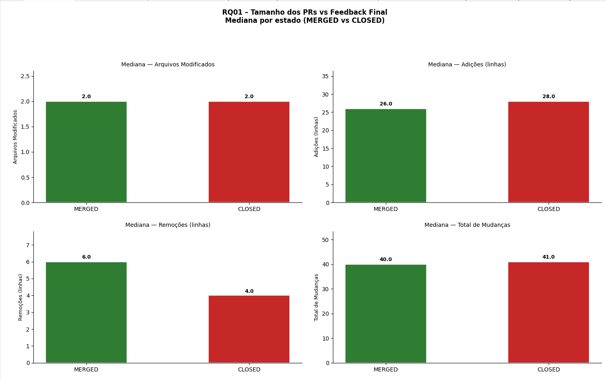

**Medianas por estado:**

| Métrica de Tamanho   | MERGED | CLOSED | Diferença |
| -------------------- | ------ | ------ | --------- |
| Arquivos Modificados | 2,0    | 2,0    | 0,0%      |
| Adições (linhas)     | 26,0   | 28,0   | +7,7%     |
| Remoções (linhas)    | 6,0    | 4,0    | −33,3%    |
| Total de Mudanças    | 40,0   | 41,0   | +2,5%     |

**Correlação de Spearman (variável vs estado, MERGED=1, CLOSED=0):**

| Variável Explicativa | ρ       | p-valor   | Classificação |
| -------------------- | ------- | --------- | ------------- |
| Total de Mudanças    | +0,0037 | 2,88×10⁻³ | Desprezível   |
| Arquivos Modificados | +0,0293 | ≈ 0       | Desprezível   |

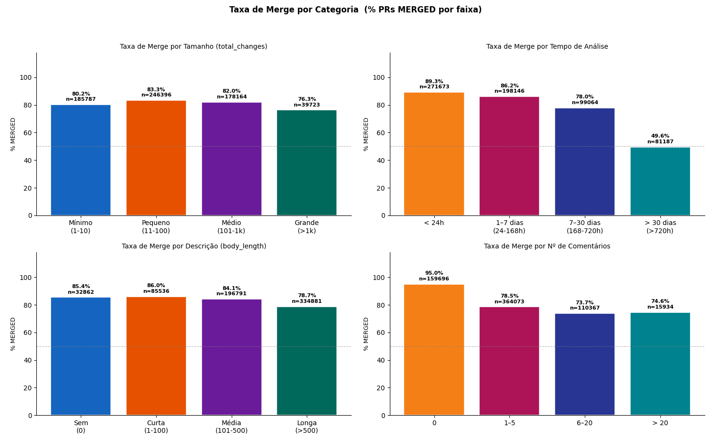

**Observação**: As medianas de MERGED e CLOSED são praticamente idênticas para todas as métricas de tamanho. As correlações de Spearman são desprezíveis (|ρ| < 0,03), indicando ausência de associação entre tamanho do PR e resultado final.

---

### 3.4 RQ02 – Tempo de Análise vs Feedback Final

> _Hipótese H2: PRs com maior tempo de análise tendem a ser rejeitados (CLOSED)._

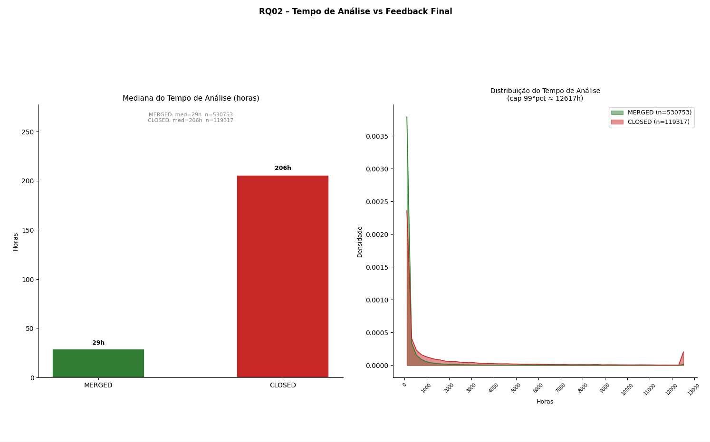

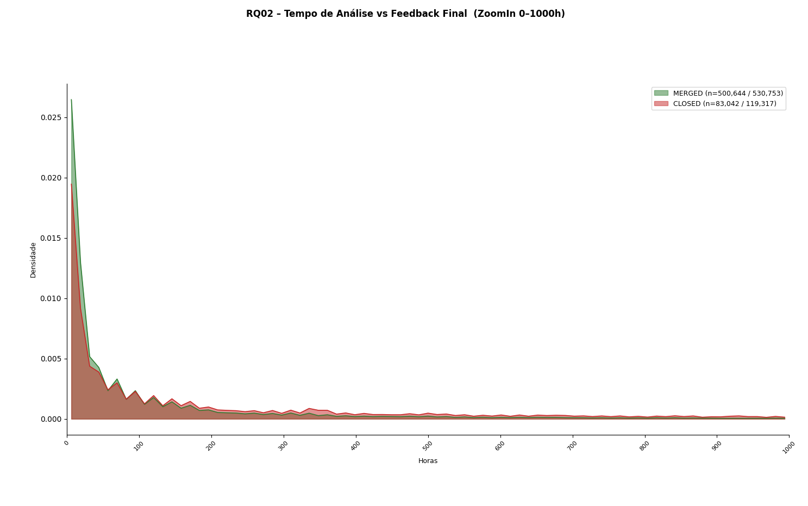

**Medianas por estado:**

| Métrica              | MERGED | CLOSED  | Diferença |
| -------------------- | ------ | ------- | --------- |
| Tempo de Análise (h) | 29,4 h | 205,6 h | −85,7%    |

**Correlação de Spearman:**

| Variável Explicativa | ρ       | p-valor | Classificação  |
| -------------------- | ------- | ------- | -------------- |
| Tempo de Análise (h) | −0,2571 | ≈ 0     | Fraca negativa |

**Observação**: PRs MERGED têm mediana de tempo quase sete vezes menor que PRs CLOSED (29,4h vs 205,6h). O Spearman confirma correlação fraca negativa significativa: quanto maior o tempo de análise, menor a probabilidade de merge.

---

### 3.5 RQ03 – Descrição dos PRs vs Feedback Final

> _Hipótese H3: PRs com descrições mais longas têm maior probabilidade de merge._

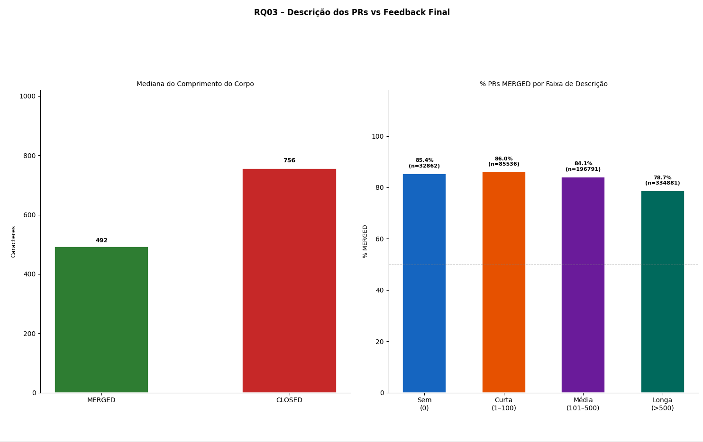

**Medianas por estado:**

| Métrica                  | MERGED | CLOSED | Diferença |
| ------------------------ | ------ | ------ | --------- |
| Comprimento da Descrição | 492,0  | 756,0  | +53,7%    |

**Correlação de Spearman:**

| Variável Explicativa     | ρ       | p-valor | Classificação        |
| ------------------------ | ------- | ------- | -------------------- |
| Comprimento da Descrição | −0,0763 | ≈ 0     | Desprezível negativa |

**Observação**: Contrariamente à hipótese, PRs CLOSED têm descrições medianamente mais longas (756 chars) do que PRs MERGED (492 chars). A correlação de Spearman é negativa porém desprezível. Uma explicação plausível é que PRs rejeitados podem gerar mais revisões de texto pelo autor (justificativas, respostas a revisores) antes do fechamento definitivo, inflando o `body_length`.

---

### 3.6 RQ04 – Interações vs Feedback Final

> _Hipótese H4: PRs com mais interações (comentários, participantes) tendem a ser rejeitados com mais frequência._

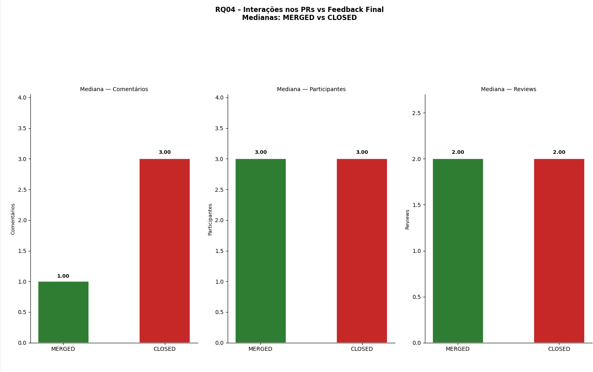

**Medianas por estado:**

| Métrica de Interação | MERGED | CLOSED | Diferença |
| -------------------- | ------ | ------ | --------- |
| Comentários          | 1,0    | 3,0    | +200,0%   |
| Participantes        | 3,0    | 3,0    | 0,0%      |
| Número de Reviews    | 2,0    | 2,0    | 0,0%      |

**Correlação de Spearman:**

| Variável Explicativa | ρ       | p-valor | Classificação        |
| -------------------- | ------- | ------- | -------------------- |
| Comentários          | −0,2195 | ≈ 0     | Fraca negativa       |
| Participantes        | −0,0744 | ≈ 0     | Desprezível negativa |

**Observação**: PRs CLOSED têm o triplo de comentários na mediana (3 vs 1). A correlação de Spearman para comentários é fraca negativa (ρ = −0,22), confirmando que mais comentários estão associados a menor probabilidade de merge. Participantes têm correlação desprezível.

---

### 3.7 RQ05 – Tamanho dos PRs vs Número de Revisões

> _Hipótese H5: PRs maiores exigem mais revisões._

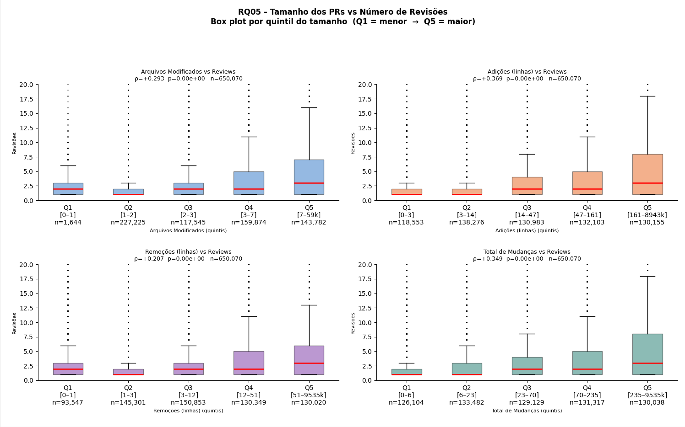

**Correlação de Spearman (variável vs `reviews_count`, n = 650.070):**

| Variável Explicativa | ρ       | p-valor | Classificação |
| -------------------- | ------- | ------- | ------------- |
| Total de Mudanças    | +0,3495 | ≈ 0     | Fraca         |
| Arquivos Modificados | +0,2932 | ≈ 0     | Fraca         |

**Observação**: Há correlação fraca positiva entre tamanho e número de revisões. Os box plots por quintil de tamanho mostram crescimento gradual da mediana de revisões à medida que o PR aumenta, confirmando a tendência ainda que com grande dispersão.

---

### 3.8 RQ06 – Tempo de Análise vs Número de Revisões

> _Hipótese H6: PRs com maior tempo de análise acumulam mais revisões._

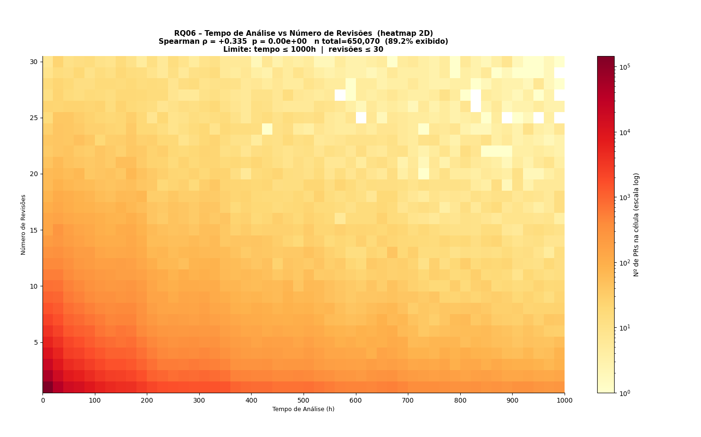

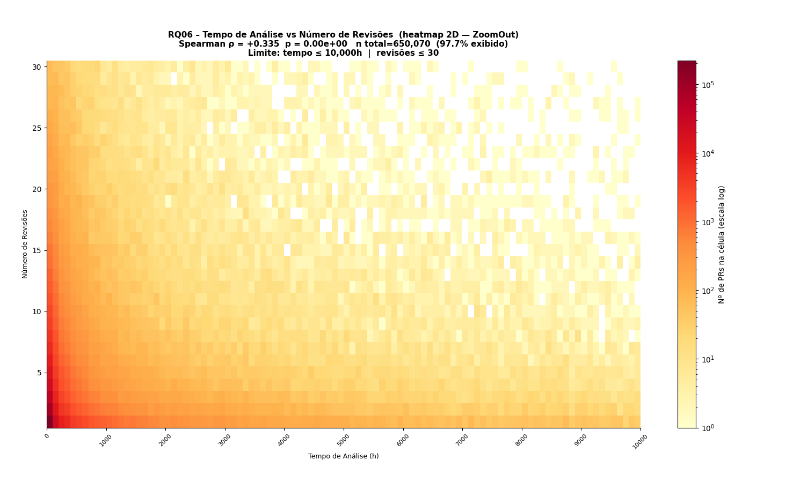

**Correlação de Spearman:**

| Variável Explicativa | ρ       | p-valor | Classificação |
| -------------------- | ------- | ------- | ------------- |
| Tempo de Análise (h) | +0,3346 | ≈ 0     | Fraca         |

**Observação**: Correlação fraca positiva confirma que PRs mais longos tendem a acumular mais revisões. O heatmap 2D mostra que a maior densidade de PRs se concentra em tempos curtos (0–200h) com 1–3 revisões, com a cauda superior apresentando maior número de revisões.

---

### 3.9 RQ07 – Descrição dos PRs vs Número de Revisões

> _Hipótese H7: PRs com descrições mais detalhadas exigem menos revisões._

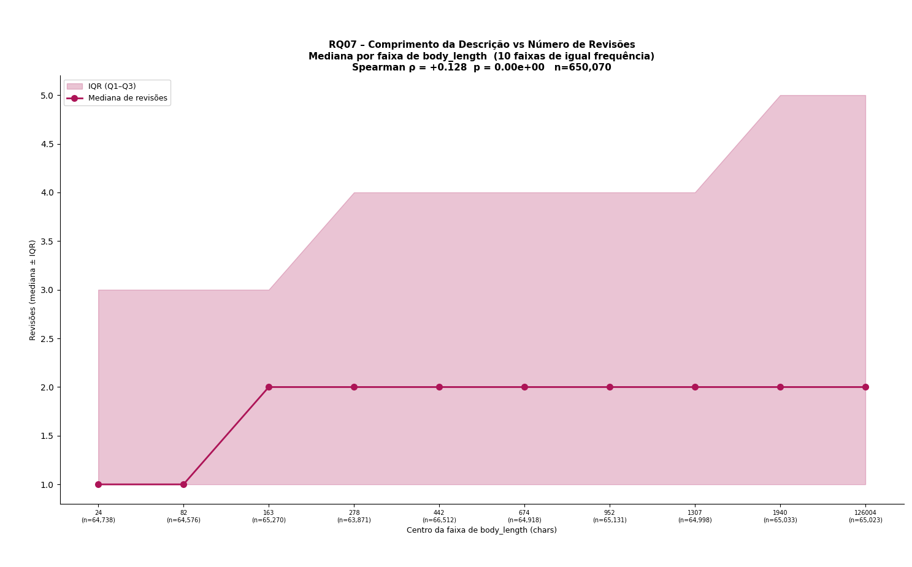

**Correlação de Spearman:**

| Variável Explicativa     | ρ       | p-valor | Classificação |
| ------------------------ | ------- | ------- | ------------- |
| Comprimento da Descrição | +0,1283 | ≈ 0     | Desprezível   |

**Observação**: A correlação é positiva e desprezível (o oposto da direção esperada pela hipótese H7). A descrição mais longa não reduz o número de revisões; pelo contrário, há uma fraca tendência de PRs mais descritos acumularem mais revisões (possivelmente porque PRs mais complexos tanto exigem mais explicação quanto mais ciclos de revisão).

---

### 3.10 RQ08 – Interações vs Número de Revisões

> _Hipótese H8: PRs com mais interações correlacionam-se positivamente com o número de revisões._

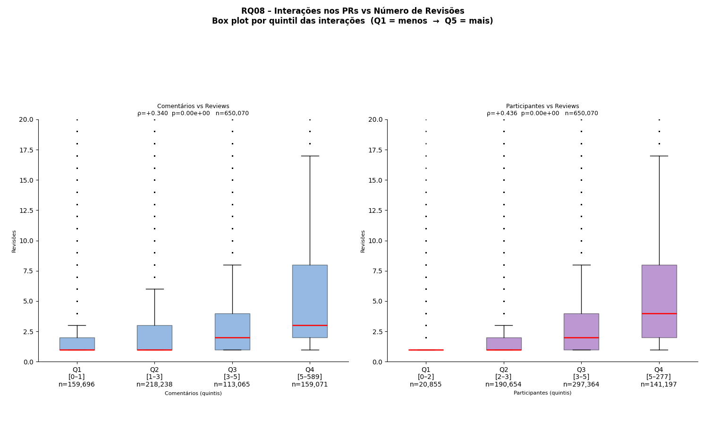

**Correlação de Spearman:**

| Variável Explicativa | ρ       | p-valor | Classificação |
| -------------------- | ------- | ------- | ------------- |
| Participantes        | +0,4358 | ≈ 0     | Moderada      |
| Comentários          | +0,3395 | ≈ 0     | Fraca         |

**Observação**: Esta é a RQ com as correlações mais expressivas do estudo. Participantes apresenta correlação moderada (ρ = +0,44), e comentários correlação fraca (ρ = +0,34). Quanto mais pessoas e discussões envolvidas no PR, maior o número de revisões (padrão esperado e bem confirmado pelos dados).

---

### 3.11 Sumário das Correlações de Spearman


**vs Estado final (MERGED=1 / CLOSED=0):**

| Variável Explicativa     | ρ       | Classificação        | H confirmada?  |
| ------------------------ | ------- | -------------------- | -------------- |
| Tempo de Análise (h)     | −0,2571 | Fraca negativa       | ✓ Sim (H2)     |
| Comentários              | −0,2195 | Fraca negativa       | ✓ Sim (H4)     |
| Comprimento da Descrição | −0,0763 | Desprezível negativa | ✗ Não (H3)     |
| Participantes            | −0,0744 | Desprezível negativa | ✓ Parcial (H4) |
| Arquivos Modificados     | +0,0293 | Desprezível          | ✗ Não (H1)     |
| Total de Mudanças        | +0,0037 | Desprezível          | ✗ Não (H1)     |

**vs Número de Revisões:**

| Variável Explicativa     | ρ       | Classificação | H confirmada? |
| ------------------------ | ------- | ------------- | ------------- |
| Participantes            | +0,4358 | Moderada      | ✓ Sim (H8)    |
| Total de Mudanças        | +0,3495 | Fraca         | ✓ Sim (H5)    |
| Comentários              | +0,3395 | Fraca         | ✓ Sim (H8)    |
| Tempo de Análise (h)     | +0,3346 | Fraca         | ✓ Sim (H6)    |
| Arquivos Modificados     | +0,2932 | Fraca         | ✓ Sim (H5)    |
| Comprimento da Descrição | +0,1283 | Desprezível   | ✗ Não (H7)    |

---

## 4. Discussão

### 4.1 RQ01 – Tamanho não determina o resultado

**Hipótese**: PRs maiores seriam rejeitados com mais frequência.

**Resultado**: As medianas de tamanho entre MERGED e CLOSED são praticamente idênticas (40 vs 41 mudanças), e as correlações de Spearman são desprezíveis (ρ < 0,03). A hipótese H1 foi **refutada**.

A ausência de relação pode ser explicada pelo comportamento dos projetos open source: mantenedores avaliam PRs principalmente pela qualidade e relevância da mudança, não pelo volume de linhas alteradas. Grandes reformas arquiteturais ou correções de bugs extensas são frequentemente aceitas, enquanto pequenas alterações fora do escopo são rejeitadas. Isso sugere que **qualidade e pertinência superam quantidade** na decisão de merge.

### 4.2 RQ02 – Tempo é o melhor preditor do estado final

**Hipótese**: PRs com maior tempo de análise tendem a ser rejeitados.

**Resultado**: Confirmação clara (a mediana de tempo de PRs CLOSED (205,6h ≈ 8,6 dias) é quase sete vezes maior que a de MERGED (29,4h ≈ 1,2 dia). O Spearman confirma correlação fraca negativa (ρ = −0,26, p ≈ 0). A hipótese H2 foi **confirmada**.

PRs que ficam abertos por muito tempo provavelmente enfrentam problemas como conflitos de merge acumulados, perda de interesse do autor, mudanças de direção do projeto ou necessidade de revisões substanciais nunca concluídas. Esta é, dentre todas as variáveis analisadas, a que melhor discrimina MERGED de CLOSED.

### 4.3 RQ03 – Descrição mais longa está associada a rejeição

**Hipótese**: Descrições mais detalhadas facilitariam a revisão e aumentariam as chances de merge.

**Resultado**: PRs CLOSED têm mediana de `body_length` 53,7% maior (756 vs 492 chars). O Spearman é negativo e desprezível (ρ = −0,08). A hipótese H3 foi **refutada**.

Uma explicação plausível é que PRs complexos ou controversos naturalmente motivam o autor a escrever mais - justificando escolhas de design, respondendo a revisores e explicando trade-offs - mas essa complexidade também aumenta a chance de rejeição. A descrição longa pode ser, portanto, um reflexo da complexidade do PR, e não uma causa de sua rejeição.

### 4.4 RQ04 – Comentários indicam dificuldade de aprovação

**Hipótese**: Mais interações indicariam controvérsia e, portanto, menor taxa de merge.

**Resultado**: PRs CLOSED têm o triplo de comentários na mediana (3 vs 1). A correlação de Spearman para comentários é fraca negativa (ρ = −0,22). A hipótese H4 foi **confirmada** para comentários; participantes tiveram resultado desprezível.

Discussões extensas em PRs frequentemente sinalizam desacordo entre autor e revisores sobre abordagem técnica, aderência ao estilo do projeto ou necessidade da mudança. Esse padrão é consistente com a literatura de code review que aponta discussões prolongadas como indicadores de PRs problemáticos.

### 4.5 RQ05 – Tamanho e revisões: correlação fraca mas consistente

**Hipótese**: PRs maiores exigem mais revisões.

**Resultado**: Correlação fraca positiva confirmada (ρ ≈ +0,29 a +0,35). A hipótese H5 foi **confirmada**.

O padrão é intuitivo: mais código a revisar exige mais passagens pelo código. Porém a correlação ser fraca (e não moderada ou forte) sugere que fatores como complexidade lógica, clareza do código e histórico do autor pesam mais do que o volume bruto de mudanças.

### 4.6 RQ06 – Tempo e revisões: mais ciclos, mais tempo

**Hipótese**: PRs mais longos acumulam mais revisões.

**Resultado**: Correlação fraca positiva (ρ = +0,33, p ≈ 0). A hipótese H6 foi **confirmada**.

Mais ciclos de revisão naturalmente alongam o processo, e processos longos acumulam mais revisões - há aqui uma relação bidirecional (cada revisão adiciona tempo; mais tempo permite mais revisões). O heatmap 2D evidencia essa concentração na região de baixo tempo e poucas revisões, com dispersão crescente conforme ambas as variáveis aumentam.

### 4.7 RQ07 – Descrição não reduz revisões

**Hipótese**: Descrições mais ricas reduziriam o número de revisões necessárias.

**Resultado**: A correlação é positiva desprezível (ρ = +0,13), o oposto da direção esperada. A hipótese H7 foi **refutada**.

PRs mais complexos tendem simultaneamente a ter descrições mais longas e a exigir mais revisões - ambas são consequências da complexidade, não causas uma da outra. Uma descrição clara pode ajudar individualmente, mas nos dados agregados esse efeito é sobreposto pela correlação entre complexidade e ambas as variáveis.

### 4.8 RQ08 – Interações e revisões: a correlação mais forte

**Hipótese**: Mais interações correlacionam-se positivamente com o número de revisões.

**Resultado**: Participantes apresenta a correlação moderada mais expressiva do estudo (ρ = +0,44), e comentários apresenta correlação fraca (ρ = +0,34). A hipótese H8 foi **confirmada**.

PRs que envolvem mais revisores e mais discussões naturalmente acumulam mais ciclos de revisão. Este resultado reforça que o número de participantes é o melhor preditor individual do número de revisões - mais do que o tamanho ou o tempo.

### 4.9 Limitações do Estudo

1. **Causalidade**: Correlações não implicam causalidade. As relações observadas podem ser mediadas por variáveis não coletadas (domínio do PR, tipo de projeto, experiência do autor).

2. **Viés de seleção de repositórios**: Foram considerados apenas repositórios populares (≥ 100 PRs MERGED+CLOSED). Projetos menores ou menos ativos podem apresentar padrões diferentes.

3. **Filtro de tempo mínimo (> 1h)**: O filtro elimina revisões muito rápidas, que podem ser um subgrupo relevante (ex.: hotfixes urgentes aceitos imediatamente).

4. **`body_length` sem normalização de markdown**: O comprimento do corpo inclui sintaxe markdown (imagens, links, tabelas), o que pode distorcer a métrica de riqueza da descrição.

5. **Snapshot temporal**: Os dados representam um momento único. PRs e padrões de revisão evoluem ao longo do tempo em cada projeto.

---

## 5. Conclusão

Este estudo analisou 650.070 Pull Requests coletados de 196 repositórios populares do GitHub, investigando como tamanho, tempo de análise, descrição e interações se relacionam com o resultado final (MERGED/CLOSED) e com o número de revisões.

**Principais achados:**

| RQ   | Variável         | Resposta    | ρ / Evidência           | H Confirmada? |
| ---- | ---------------- | ----------- | ----------------------- | ------------- |
| RQ01 | Tamanho          | Estado      | ρ ≈ 0,00 (desprezível)  | ✗ Não         |
| RQ02 | Tempo de Análise | Estado      | ρ = −0,26 (fraca)       | ✓ Sim         |
| RQ03 | Descrição        | Estado      | ρ = −0,08 (desprezível) | ✗ Não         |
| RQ04 | Comentários      | Estado      | ρ = −0,22 (fraca)       | ✓ Sim         |
| RQ05 | Tamanho          | Nº Revisões | ρ = +0,35 (fraca)       | ✓ Sim         |
| RQ06 | Tempo de Análise | Nº Revisões | ρ = +0,33 (fraca)       | ✓ Sim         |
| RQ07 | Descrição        | Nº Revisões | ρ = +0,13 (desprezível) | ✗ Não         |
| RQ08 | Participantes    | Nº Revisões | ρ = +0,44 (moderada)    | ✓ Sim         |

O **tempo de análise** é a variável que melhor discrimina PRs aceitos de rejeitados: PRs MERGED têm mediana de 29,4h contra 205,6h dos CLOSED. O **número de participantes** é o melhor preditor do número de revisões (ρ = +0,44). O tamanho do PR e o comprimento da descrição, surpreendentemente, têm efeito desprezível sobre o estado final, indicando que a decisão de merge em projetos open source é guiada mais por fatores qualitativos e dinâmicos do que por volume de código ou extensão da justificativa.
