# Relatório - Laboratório 4: Visualização de Dados com BI

**Disciplina:** Experimentação de Software - PUCMINAS  
**Ferramenta de BI:** Google Looker Studio  
**Dataset:** Stack Overflow Developer Survey 2024  
**Data:** Junho de 2026

---

## 1. Introdução

Business Intelligence (BI) é o conjunto de processos e tecnologias que transformam grandes volumes de dados em informações acionáveis para apoio à tomada de decisões. Dashboards interativos, um dos principais artefatos de BI, permitem explorar os dados visualmente, identificar tendências e responder a perguntas de pesquisa de forma clara e objetiva.

No contexto de engenharia de software, compreender o perfil e as condições de trabalho dos desenvolvedores é fundamental para embasar decisões organizacionais, como políticas de trabalho remoto, planos de carreira e adoção de tecnologias. Para isso, o **Stack Overflow Developer Survey** constitui uma das fontes de dados mais abrangentes e confiáveis disponíveis publicamente.

Este laboratório tem como objetivo construir um dashboard no **Google Looker Studio** utilizando os dados do Stack Overflow Developer Survey 2024, respondendo questões de pesquisa sobre a relação entre características de carreira dos desenvolvedores (linguagem, educação, experiência, modelo de trabalho) e indicadores como salário e satisfação profissional.

---

## 2. Metodologia / Descrição da Base de Dados

### 2.1 Fonte dos Dados

O **Stack Overflow Developer Survey 2024** é uma pesquisa anual conduzida pelo Stack Overflow com desenvolvedores de software ao redor do mundo. A edição de 2024 contou com aproximadamente **65.000 respondentes** de mais de 180 países, cobrindo tópicos como tecnologias utilizadas, condições de trabalho, salário e satisfação profissional.

O dataset é disponibilizado publicamente em formato CSV no endereço:  
**https://survey.stackoverflow.co/2024/**

### 2.2 Pré-processamento

Os dados foram processados com Python (`pandas`) através do script `scripts/process_data.py`. As transformações aplicadas foram:

1. **Seleção de colunas:** 16 variáveis relevantes para as questões de pesquisa foram selecionadas do dataset original (que contém mais de 100 colunas).
2. **Filtragem de respondentes:** foram mantidos apenas respondentes com vínculo empregatício ativo (empregados, freelancers, contratados independentes), excluindo estudantes puros e desempregados.
3. **Limpeza de valores ausentes:** colunas críticas como salário e experiência foram tratadas para remoção de outliers extremos (salário > $500k/ano foi descartado como erro de entrada).
4. **Tradução e padronização:** campos categóricos como nível educacional, modelo de trabalho e satisfação foram traduzidos e padronizados para o português.
5. **Derivação de novas variáveis:**
   - `linguagem_principal`: primeira linguagem listada pelo respondente
   - `grupo_exp`: faixas de experiência profissional (0–1 ano, 2–4 anos, etc.)
   - `faixa_salarial`: categorização do salário anual em faixas
   - `satisfacao_score`: escala numérica de 1 a 5 para satisfação

### 2.3 Caracterização do Dataset

https://datastudio.google.com/reporting/62522a26-c8b5-4910-b314-b4535355f1c9

**Principais características do dataset processado:**

- **Total de respondentes (empregados):** 59105
- **Países representados:** mais de 150 países
- **Top 5 países:** Estados Unidos, Alemanha, Índia, Reino Unido, Ucrania
- **Top 5 linguagens principais:** Bash/Shell, C#, HTML/CSS, C, Java
- **Distribuição por modelo de trabalho:** Híbrido (~39%), Remoto (~35%), Presencial (~18%)
- **Mediana salarial:** $64,629.00 USD/ano
- **Mediana de satisfação:** 6.94/10

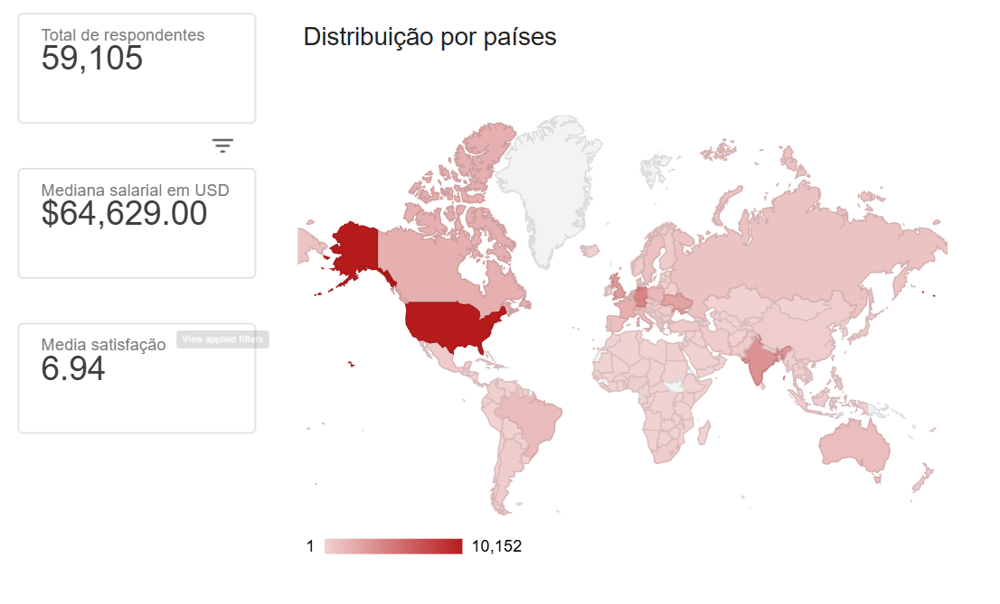

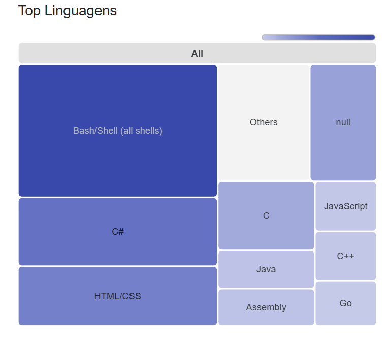

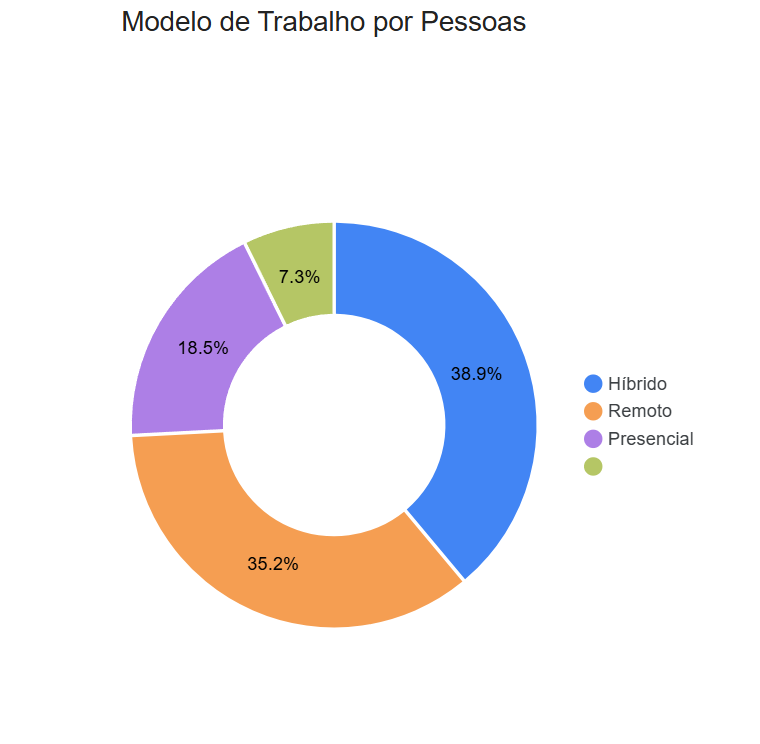

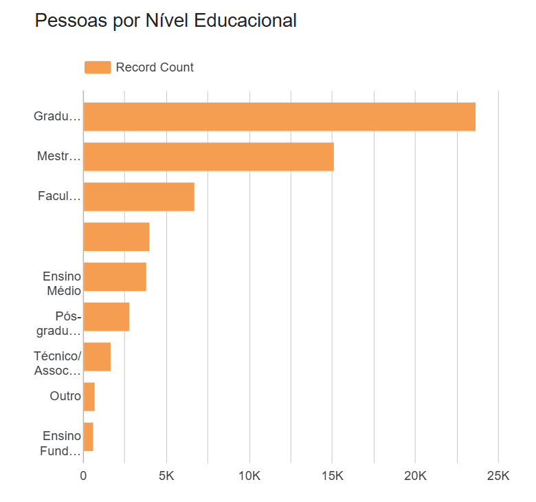

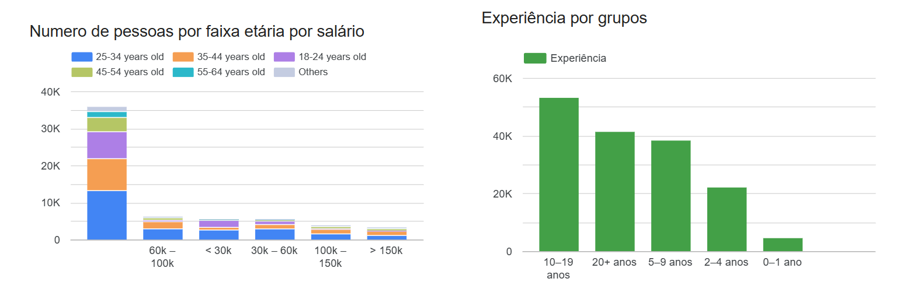

---

## 3. Resultados

### RQ1: Como a linguagem de programação principal se relaciona com o salário dos desenvolvedores?

**Hipótese:** esperava-se que linguagens frequentemente utilizadas em sistemas de alto desempenho (Go, Rust, Kotlin) ou em grandes corporações (Scala, Swift) apresentassem medianas salariais mais elevadas do que linguagens de script mais acessíveis (PHP, Ruby).

**Observações:** O topo do ranking é dominado por lingágens de nicho, legadas ou de comunidades pequenas. As linguagens muito difundidas tendem a ter muitos profissionais disponíveis, jogando a mediana salarial para baixo.

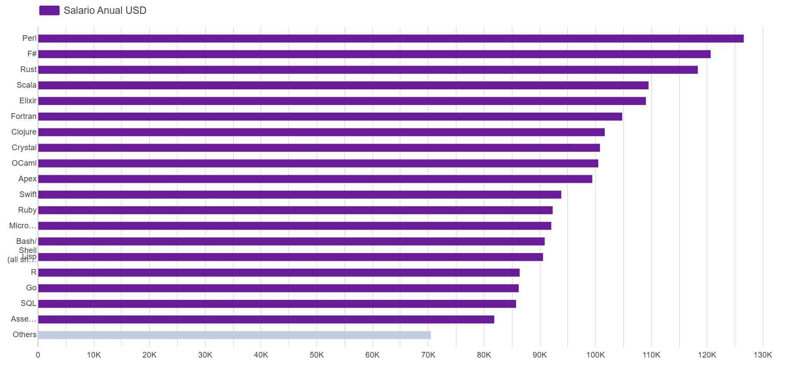

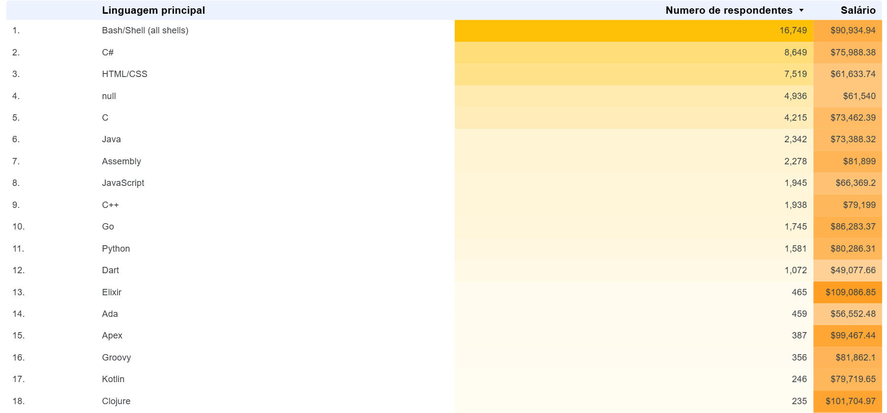

---

### RQ2: Como o modelo de trabalho (remoto/presencial/híbrido) se relaciona com a satisfação profissional?

**Hipótese:** desenvolvedores em regime totalmente remoto ou híbrido tendem a apresentar maior satisfação profissional em comparação com trabalhadores presenciais, dado o maior controle sobre a própria rotina.

**Observações:** Em geral, sim, a satisfação aumenta quanto mais o trabalho é feito de maneira remota, com a menor sendo prescencial e a maior sendo remoto, porém é importante enfatizar que a variancia das satisfações foi bem menor que o esperado, com muitos desenvolvedores não respondendo sobre satisfação (null)

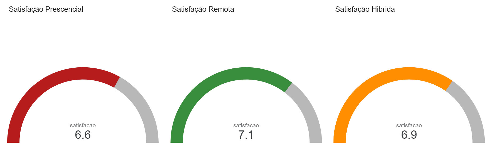

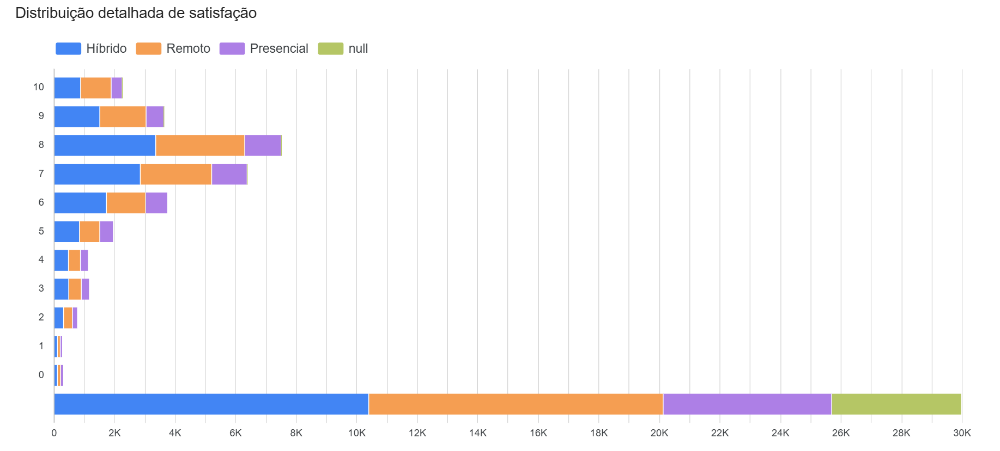

---

### RQ3: Qual a relação entre nível educacional e salário dos desenvolvedores?

**Hipótese:** espera-se uma correlação positiva entre nível educacional e salário, com titulados em mestrado e doutorado recebendo mais do que graduados, que por sua vez recebem mais do que aqueles sem formação superior.

**Observações:** percebe-se que a correlação é positiva sim, porém com uma observação importante. Com os dados coletados, a diferença salarial entre Mestrado e Graduação, e entre Técnico e Faculdade Incompleta é baixo, por volta de $1000, onde entre Pós/Doutorado e Mestrado a diferença é de $10000.

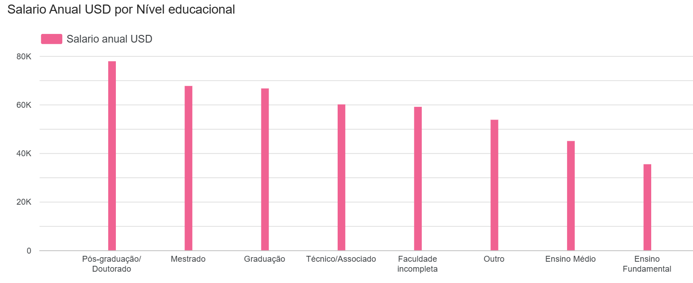

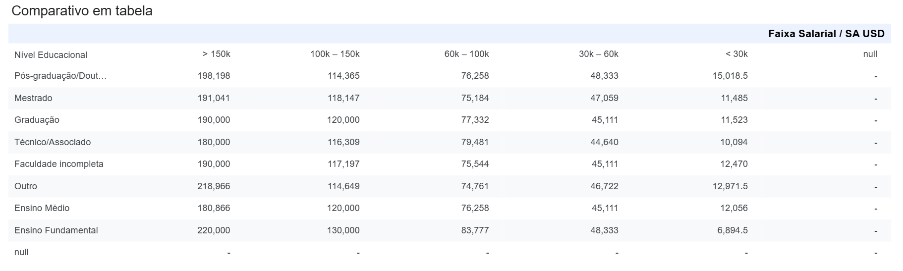

---

### RQ4: Como os anos de experiência influenciam o salário?

**Hipótese:** espera-se uma relação positiva entre anos de experiência e salário, com crescimento mais acentuado nos primeiros anos e estabilização após 15–20 anos de carreira.

**Observações:** Em realidade, percebe-se um crescimento linear, com média de crescimento entre os grupos em ~$16200, com os maiores crescimentos salariais vindo nos anos posteriores 5-20.

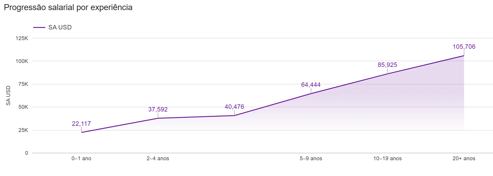

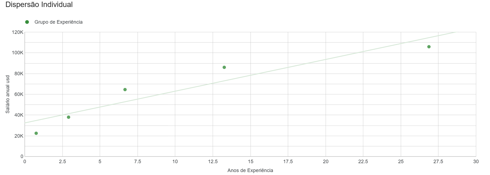

---

## 4. Discussão

### 4.1 Síntese dos Resultados

**RQ1 (Linguagem x Salário):** a hipótese foi confirmada apenas parcialmente. Linguagens associadas a sistemas de alto desempenho, como **Rust** (~$118k) e **Scala** (~$110k), realmente figuram entre as mais bem pagas, conforme esperado. Porém, o topo do ranking foi dominado por linguagens legadas ou de nicho, **Perl** (~$126k), **F#** (~$121k), **Fortran**, **Clojure**, **Crystal**, **OCaml** e **Elixir** (~$109k), que possuem pouquíssimos profissionais no dataset (Elixir, por exemplo, tem apenas 465 respondentes contra os 16.749 de Bash/Shell). O heatmap reforça esse padrão: as três linguagens mais comuns (Bash/Shell, C#, HTML/CSS) têm medianas salariais entre $61k e $91k, inferiores às de linguagens raras com demanda especializada. Isso sugere que a **escassez/raridade da linguagem no mercado** é um fator mais determinante para o salário mediano do que sua aplicação em sistemas críticos ou de alta performance.

**RQ2 (Modelo de Trabalho x Satisfação):** a hipótese foi confirmada na direção esperada, porém com magnitude bem menor que a prevista. A satisfação média foi **Remoto 7,1**, **Híbrido 6,9** e **Presencial 6,6** (escala 0–10), uma diferença de apenas 0,5 ponto entre o melhor e o pior modelo. A distribuição detalhada mostra que a maioria das respostas se concentra nas notas 7 e 8 independentemente do modelo de trabalho, e que uma fração relevante dos respondentes (a categoria "null") não informou o modelo de trabalho. Isso indica que o regime de trabalho tem influência real, porém modesta, sobre a satisfação, outros fatores (remuneração, relação com a equipe, natureza das atividades) provavelmente têm peso maior.

**RQ3 (Educação x Salário):** a tendência geral de correlação positiva foi confirmada, **Pós-graduação/Doutorado** (~$78k) lidera, seguido por **Mestrado** (~$68k) e **Graduação** (~$67k), depois **Técnico/Associado** (~$60k) e **Faculdade Incompleta** (~$59k), **Outro** (~$54k), **Ensino Médio** (~$45k) e, por último, **Ensino Fundamental** (~$35k). Contudo, o salto mais expressivo ocorre apenas entre Pós-graduação/Doutorado e os demais níveis (diferença de ~$10k em relação ao Mestrado), enquanto entre níveis intermediários (Mestrado-Graduação, Técnico-Faculdade Incompleta) a diferença é marginal (~$1k). A tabela comparativa por faixa salarial reforça essa leitura: dentro de uma mesma faixa salarial (ex: $60k–$100k), as medianas entre os diferentes níveis educacionais ficam muito próximas, e em alguns casos o Ensino Fundamental supera até a Pós-graduação/Doutorado na mesma faixa. Isso sugere que o nível educacional influencia mais a **probabilidade de alcançar as faixas salariais mais altas** (>$150k) do que o salário dentro de uma mesma faixa.

**RQ4 (Experiência x Salário):** a hipótese de relação positiva foi confirmada, mas o formato observado diferiu do esperado. Em vez de um crescimento acentuado nos primeiros anos seguido de estabilização após 15–20 anos, observou-se um crescimento **aproximadamente linear ao longo de toda a carreira**: a mediana salarial sai de ~$22k (0–1 ano) e chega a ~$106k (20+ anos), com incremento médio entre faixas em torno de $16k–$21k. Os maiores saltos ocorreram justamente nas faixas de 5 a 20 anos, e não nos primeiros anos, como hipotetizado. O gráfico de dispersão individual confirma essa linearidade, com os pontos de cada grupo de experiência aderindo de forma consistente à linha de tendência.

### 4.2 Implicações Práticas

- **Para profissionais:** especializar-se em linguagens de nicho com alta demanda relativa (Elixir, Rust, Clojure, OCaml) pode representar um diferencial salarial significativo, mas implica em um mercado de trabalho mais restrito, com menos vagas disponíveis. A escolha de stack tecnológico deve equilibrar potencial de remuneração com empregabilidade.
- **Para empresas:** oferecer/manter trabalho remoto tem impacto positivo, ainda que modesto, sobre a satisfação dos colaboradores, mas não deve ser tratado como solução isolada para retenção de talentos, fatores organizacionais como carga de trabalho, cultura e reconhecimento provavelmente pesam mais.
- **Para políticas de carreira e educação:** programas de pós-graduação (mestrado/doutorado) parecem ser o investimento educacional com maior retorno salarial relativo, especialmente para acessar as faixas salariais mais altas. Já a diferença entre diplomas intermediários (graduação vs. técnico) tem peso salarial pequeno, sugerindo que experiência prática pode compensar parcialmente a ausência de um diploma de nível superior completo.
- **Para gestão de carreira individual:** como o crescimento salarial por experiência é praticamente linear e sustentado mesmo após 20 anos, profissionais não devem esperar uma "estabilização" precoce, manter-se atualizado e em evolução técnica continua trazendo retorno financeiro mesmo em estágios avançados da carreira.

### 4.3 Limitações

Algumas limitações devem ser consideradas na interpretação dos resultados:

- **Viés de auto-seleção:** o survey é respondido voluntariamente, o que pode super-representar desenvolvedores mais engajados com a comunidade Stack Overflow.
- **Salário em USD:** os salários são reportados em USD, o que favorece naturalmente respondentes de países com salários nominalmente maiores, como EUA e Europa Ocidental.
- **Linguagem principal simplificada:** a variável `linguagem_principal` foi extraída como a primeira linguagem listada, o que pode não refletir com precisão a linguagem mais usada pelo respondente.
- **Dados de 2024:** os dados refletem o mercado de trabalho de 2024, e tendências como adoção de IA podem ter alterado o cenário desde então.

### 4.4 Conclusão

O dashboard construído no Google Looker Studio permitiu responder, de forma visual e exploratória, às quatro questões de pesquisa propostas, a partir de uma amostra de quase 60 mil desenvolvedores empregados do Stack Overflow Developer Survey 2024. Em linhas gerais, as hipóteses iniciais foram **parcialmente confirmadas**: existe uma relação entre raridade da linguagem e salário (RQ1), entre flexibilidade do modelo de trabalho e satisfação (RQ2), entre nível educacional e salário (RQ3) e entre experiência e salário (RQ4), mas em todos os casos a magnitude e o formato dessas relações surpreenderam em relação ao previsto, reforçando a importância da análise exploratória de dados antes de conclusões definitivas. Ferramentas de BI como o Looker Studio mostraram-se eficazes para tornar esses padrões rapidamente visíveis e interpretáveis, mesmo em um dataset com decenas de milhares de respondentes e múltiplas dimensões. Como trabalhos futuros, seria interessante segmentar essas análises por país/região (dado o forte viés de respondentes dos EUA) e investigar interações entre variáveis, como educação x experiência x salário ou linguagem x modelo de trabalho.

---

## Referências

- Stack Overflow. _Developer Survey 2024_. Disponível em: https://survey.stackoverflow.co/2024/. Acesso em: junho de 2026.
- Google. _Looker Studio_. Disponível em: https://lookerstudio.google.com/. Acesso em: junho de 2026.
