# Relatório: GraphQL vs REST, Um Experimento Controlado

**Disciplina**: Experimentação de Software
**Instituição**: PUCMINAS
**Período**: 01/2026
**Autores**: Augusto Fuscaldi e Filipe Faria

**Status**: Lab05S01 (desenho do experimento e preparação), Lab05S02 (execução, análise e relatório final) e Lab05S03 (dashboard) estão concluídos.

---

## 1. Introdução

### 1.1 Contextualização

GraphQL é uma linguagem de consulta baseada em grafos, proposta pelo Facebook, que permite a um cliente especificar exatamente quais campos deseja receber em uma única requisição. Isso contrasta com o modelo REST, no qual cada endpoint retorna uma representação fixa do recurso, frequentemente contendo mais dados do que o cliente realmente precisa (over-fetching) ou exigindo múltiplas chamadas para reunir dados relacionados (under-fetching). Diversos sistemas migraram ou passaram a oferecer GraphQL como alternativa às suas APIs REST, mas não há consenso claro sobre o ganho real dessa adoção em termos de desempenho.

### 1.2 Problema Foco do Experimento

Este experimento utiliza a API pública do GitHub, que expõe os mesmos dados tanto via REST v3 quanto via GraphQL v4, como ambiente controlado para comparar as duas tecnologias em uma tarefa idêntica: obter os metadados de um repositório. Por oferecer as duas implementações para o mesmo provedor de dados, o GitHub elimina a maior parte das diferenças de infraestrutura, backend e modelagem de dados que normalmente confundiriam uma comparação entre sistemas diferentes.

### 1.3 Questões de Pesquisa

- **RQ1**: Respostas às consultas GraphQL são mais rápidas que respostas às consultas REST?
- **RQ2**: Respostas às consultas GraphQL têm tamanho menor que respostas às consultas REST?

### 1.4 Hipóteses

Para cada RQ, formula-se um par de hipóteses estatísticas (nula e alternativa), testadas sobre a mediana pareada por repositório (ver Seção 2.6):

**RQ1: Tempo de resposta**

- **H0₁**: Não há diferença no tempo de resposta entre REST e GraphQL para a consulta equivalente (mediana das diferenças pareadas = 0).
- **H1₁**: O tempo de resposta do GraphQL é diferente do tempo de resposta do REST (mediana das diferenças pareadas ≠ 0).

**RQ2: Tamanho da resposta**

- **H0₂**: Não há diferença no tamanho da resposta entre REST e GraphQL para a consulta equivalente.
- **H1₂**: O tamanho da resposta do GraphQL é diferente do tamanho da resposta do REST.

As hipóteses alternativas são formuladas de modo bidirecional (teste de duas pontas) por rigor estatístico, ainda que a expectativa teórica, dado que a consulta GraphQL solicita um subconjunto de campos enquanto o REST retorna o recurso completo, seja de que o GraphQL produza respostas menores (RQ2) e, possivelmente, mais rápidas (RQ1), por transferir menos dados.

### 1.5 Objetivos

**Objetivo principal**: medir e comparar quantitativamente tempo de resposta e tamanho de payload entre uma chamada REST e uma chamada GraphQL funcionalmente equivalentes na API do GitHub.

**Objetivos específicos**:

- Selecionar uma amostra de repositórios públicos populares como objetos experimentais.
- Implementar os dois tratamentos (REST e GraphQL) de forma instrumentada, medindo tempo de resposta (ms) e tamanho do corpo da resposta (bytes).
- Executar as medições em um projeto de medidas repetidas, com ordem de aplicação dos tratamentos aleatorizada.
- Aplicar testes estatísticos pareados apropriados e reportar os resultados para RQ1 e RQ2.

---

## 2. Metodologia e Desenho do Experimento

### 2.1 Variáveis Dependentes

| Variável | Descrição | Unidade |
|---|---|---|
| Tempo de resposta | Intervalo entre o envio da requisição e o recebimento completo da resposta (medido com `time.perf_counter()`, incluindo handshake/rede) | milissegundos (ms) |
| Tamanho da resposta | Tamanho do corpo (`body`) da resposta HTTP | bytes |

### 2.2 Variáveis Independentes

| Variável | Níveis |
|---|---|
| Tipo de API (fator único) | `REST`, `GraphQL` |

Como variável de bloco (controle), usa-se o **repositório consultado**: cada repositório é um bloco que recebe ambos os níveis do fator, permitindo um teste pareado e controlando a variação natural entre repositórios (tamanho de descrição, presença de licença, etc.).

### 2.3 Tratamentos

- **T1 (REST)**: `GET https://api.github.com/repos/{owner}/{repo}`, o endpoint padrão de leitura de repositório, sem possibilidade de seleção de campos; retorna a representação completa do recurso (~100+ campos).
- **T2 (GraphQL)**: requisição `POST https://api.github.com/graphql` com a query abaixo, solicitando **apenas os campos equivalentes** aos efetivamente utilizados a partir da resposta REST (nome, descrição, estrelas, forks, watchers, issues abertas, linguagem principal, licença, branch padrão, datas de criação/push):

```graphql
query($owner: String!, $name: String!) {
  repository(owner: $owner, name: $name) {
    nameWithOwner
    description
    stargazerCount
    forkCount
    watchers { totalCount }
    issues(states: OPEN) { totalCount }
    primaryLanguage { name }
    licenseInfo { name }
    defaultBranchRef { name }
    createdAt
    pushedAt
  }
}
```

A escolha de comparar "REST completo" vs. "GraphQL apenas com os campos necessários" não é uma falha de desenho, e sim a própria operacionalização do fenômeno em estudo: a API REST do GitHub não oferece seleção de campos, então um cliente que precisa apenas desses 10 campos necessariamente recebe o objeto inteiro. Essa é exatamente a comparação relevante na prática e é discutida como ameaça à validade de constructo na Seção 2.7.

### 2.4 Objetos Experimentais

Amostra de **N = 100 repositórios públicos** do GitHub, selecionados via Search API (`GET /search/repositories?q=stars:>1000&sort=stars`), cobrindo repositórios populares de diferentes linguagens, tamanhos de descrição e presença/ausência de licença. Essa diversidade gera variabilidade nos dados retornados e evita que a comparação dependa de um único tipo de repositório.

### 2.5 Tipo de Projeto Experimental

Projeto de **medidas repetidas (within-subject) com blocagem por repositório e aleatorização da ordem de aplicação dos tratamentos** (randomized complete block design):

- Cada repositório (bloco) recebe os dois tratamentos (REST e GraphQL), em **K = 5 repetições** cada.
- A sequência completa de medições (N × K × 2 = 1.000 chamadas) é **embaralhada globalmente** antes da execução (não apenas dentro de cada bloco) para distribuir eventuais efeitos de variação de carga do servidor, cache de CDN ou condições de rede ao longo do tempo igualmente entre os dois tratamentos, evitando que um deles seja sistematicamente favorecido por executar sempre "primeiro" ou em um horário específico.
- Uma requisição de aquecimento (uma REST, uma GraphQL) é descartada antes do início da coleta, para neutralizar o custo de estabelecimento inicial de conexão/TLS.

### 2.6 Quantidade de Medições

- **N = 100** repositórios × **K = 5** repetições × **2** tratamentos = **1.000 medições brutas** (500 por tratamento).
- **Unidade de análise do teste de hipótese**: para evitar pseudo-replicação (as K repetições de um mesmo repositório não são observações independentes entre si), cada repositório é resumido pela **mediana de suas 5 repetições** antes do teste estatístico. Isso produz **100 pares (REST, GraphQL)** independentes, um por repositório, que alimentam o teste pareado de RQ1 e RQ2.
- As 1.000 medições brutas são preservadas e usadas apenas para os gráficos descritivos de variabilidade (Seção 5.1, Revisão dos Valores Obtidos).

### 2.7 Ameaças à Validade

**Validade interna**

- Variação de latência de rede e carga momentânea dos servidores do GitHub podem afetar o tempo de resposta independentemente da tecnologia usada. Mitigada por: aleatorização global da ordem das chamadas, K=5 repetições por par e uso da mediana (robusta a outliers) na agregação por repositório.
- Cache de CDN/edge do GitHub pode fazer com que repetições da mesma consulta sejam anormalmente rápidas após a primeira chamada. Mitigada parcialmente pela aleatorização (intercala chamadas a diferentes repositórios e tratamentos, reduzindo cache hits consecutivos).

**Validade de constructo**

- A API REST do GitHub não permite seleção de campos; logo, a diferença de tamanho de payload mede tanto a tecnologia quanto a política de design da API REST do GitHub especificamente (over-fetching estrutural). O resultado é representativo do cenário real de uso (um cliente que precisa de poucos campos), mas não isola "GraphQL vs. REST" de "decisão de design da API do GitHub".
- O tempo de resposta medido no cliente inclui rede e overhead de serialização/desserialização do `requests`, não apenas o tempo de processamento no servidor.

**Validade externa**

- Os resultados são específicos da implementação do GitHub (infraestrutura, política de cache, rate limiting) e de uma única operação de leitura (consulta de metadados de repositório). Não generalizam necessariamente para outras APIs GraphQL/REST, nem para operações de escrita (mutations) ou consultas mais complexas (múltiplos níveis de aninhamento, listas grandes).
- A amostra é limitada a repositórios com mais de 1.000 estrelas; repositórios pequenos ou com metadados atípicos (sem descrição, sem licença) não foram avaliados.

**Validade de conclusão**

- K=5 repetições por repositório é suficiente para estimar uma mediana robusta, mas não captura toda a variância de rede possível em horários muito distintos. A escolha entre teste t pareado e Wilcoxon signed-rank é feita empiricamente por repositório/métrica via teste de normalidade de Shapiro-Wilk sobre as diferenças pareadas (ver `analyze_results.py`), evitando assumir normalidade indevidamente.

### 2.8 Materiais e Ambiente

- **API**: GitHub REST API v3 e GraphQL API v4 (`https://api.github.com`), autenticação por token pessoal (necessária para GraphQL; REST funciona sem token com limite de taxa reduzido).
- **Linguagem**: Python 3.12.
- **Bibliotecas**: `requests` (chamadas HTTP), `pandas` (manipulação de dados), `scipy.stats` (Shapiro-Wilk, teste t pareado, Wilcoxon signed-rank), `matplotlib` + `seaborn` (visualizações).
- **Infraestrutura de execução**: Windows 11, conexão de internet padrão (doméstica/local). Execução realizada em 26/06/2026, das 15:30 às 15:48 (UTC), sem uso de VPN ou proxy.

---

## 3. Preparação do Experimento (Passo 2)

Implementados em `trab-5/scripts/`:

- **`github_utils.py`** (módulo compartilhado): funções instrumentadas `rest_fetch_repo()` e `graphql_fetch_repo()`, que executam a chamada e retornam tempo de resposta, tamanho do corpo, status HTTP e eventuais erros; inclui retry com backoff exponencial (até 3 tentativas) e `select_top_repos()` para amostragem via Search API.
- **`select_repos.py`** (Etapa 1): gera `data/repos_amostra.csv` com a amostra de repositórios. Testado nesta sprint com uma chamada real (amostra reduzida), validando que a seleção funciona sem necessidade de token.
- **`run_experiment.py`** (Etapa 2): monta o plano de medições (N×K×2), embaralha globalmente, executa e grava incrementalmente em `data/resultados_brutos.csv` (resiliente a interrupções). Validado nesta sprint: recusa-se corretamente a executar sem um `GITHUB_TOKEN` válido (a GraphQL API do GitHub rejeita requisições anônimas).
- **`analyze_results.py`** (Etapas 3 e 4): carrega `resultados_brutos.csv`, descarta medições com falha, agrega por mediana por repositório, testa normalidade das diferenças pareadas (Shapiro-Wilk) para escolher entre teste t pareado e Wilcoxon signed-rank, e gera os gráficos em `imgs/` (boxplots, barras com IQR, slopegraph pareado e histograma da diferença, para cada RQ). Validado inicialmente com um conjunto de dados sintético e, em seguida, executado sobre os dados reais coletados, com resultados na Seção 5.

### Como obter um token do GitHub

1. Acesse https://github.com/settings/tokens.
2. Gere um token (classic) com permissão `public_repo` (leitura de repositórios públicos é suficiente).
3. Edite `GITHUB_TOKEN` no topo de `github_utils.py` (ou defina a variável de ambiente `GITHUB_TOKEN`, que tem precedência).

---

## 4. Execução do Experimento (Passo 3)

A execução real ocorreu em **26/06/2026, das 15:30:01 às 15:48:51 (UTC)**: aproximadamente **18 minutos e 50 segundos** para as 1.000 medições planejadas, com `run_experiment.py` autenticado por um token pessoal do GitHub (permissão `public_repo`).

| Item | Resultado |
|---|---|
| Repositórios (objetos experimentais) | 100, selecionados por `select_repos.py` (estrelas > 1.000) |
| Repetições por tratamento por repositório (K) | 5 |
| Medições planejadas | 1.000 (500 REST + 500 GraphQL) |
| Medições efetivamente coletadas | 1.000 |
| Respostas com status HTTP 200 | 1.000 / 1.000 (100%) |
| Falhas, timeouts ou rate limit | 0 |

Nenhuma medição precisou de retry (todas as 1.000 chamadas retornaram `status_code = 200` na primeira tentativa) e não houve necessidade de pausar ou retomar a coleta, o que indica que o intervalo de 0,2–0,5 s entre requisições foi suficiente para não disparar limites de taxa da API do GitHub.

## 5. Análise de Resultados (Passo 4)

### 5.1 Revisão dos Valores Obtidos

Antes de testar as hipóteses, os dados brutos foram inspecionados (`analyze_results.py`, etapa `load_data`):

- **Nenhuma exclusão foi necessária**: as 1.000 medições têm `ok = True`, então 100% delas entraram na análise.
- Estatísticas descritivas das medições brutas (N×K = 500 por tratamento):

| Métrica | Tratamento | Mínimo | Mediana | Média | Máximo | Desvio padrão |
|---|---|---|---|---|---|---|
| Tempo (ms) | REST | 593,6 | 766,2 | 767,2 | 2.953,0 | 133,4 |
| Tempo (ms) | GraphQL | 618,4 | 791,5 | 790,9 | 1.130,6 | 84,1 |
| Tamanho (bytes) | REST | 5.057 | 6.321,0 | 6.265,3 | 7.697 | 618,2 |
| Tamanho (bytes) | GraphQL | 366 | 431,5 | 447,5 | 718 | 59,8 |

Duas observações da revisão:

1. O **máximo de tempo do REST (2.953 ms)** está bem acima do restante da distribuição (75º percentil bem abaixo de 1.000 ms): um pico de latência isolado, provavelmente de rede, e não um padrão recorrente (não se repetiu nas demais 499 medições REST). Foi mantido na análise, pois a agregação por **mediana** por repositório (Seção 2.6) já é robusta a esse tipo de outlier pontual, e o desvio padrão maior do REST (133,4 vs 84,1 do GraphQL) reflete justamente essa cauda, sem invalidar a mediana.
2. O desvio padrão de **tamanho do GraphQL (59,8 bytes)** é pequeno relativo à sua média (447,5 bytes), o que é esperado, pois a query sempre retorna o mesmo conjunto fixo de 10 campos, variando apenas conteúdo textual (comprimento da descrição, nome da licença, etc.). Já o REST tem desvio padrão de tamanho proporcionalmente parecido (618,2 sobre 6.265,3): a resposta completa do recurso também varia com o conteúdo, mas a partir de uma base ~14× maior.

Com os dados validados, a Seção 2.6 agrega as 5 repetições de cada repositório pela mediana, gerando os **100 pares (REST, GraphQL)** usados nos testes de hipótese a seguir.

### 5.2 RQ1: Tempo de Resposta

| | REST | GraphQL |
|---|---|---|
| Mediana (100 repositórios) | 764,92 ms | 794,44 ms |
| Diferença | GraphQL **3,9% mais lento** (≈ 30 ms) | |

- **Shapiro-Wilk** na diferença pareada: p = 0,8888 (> 0,05) → diferenças compatíveis com distribuição normal.
- Teste escolhido: **t pareado** → estatística = −3,4291, **p-valor = 0,00088** (< 0,05).
- **H0₁ rejeitada**: existe diferença estatisticamente significativa, com o GraphQL sendo, em mediana, mais lento que o REST nesta amostra.

**Como ler os gráficos do RQ1:**

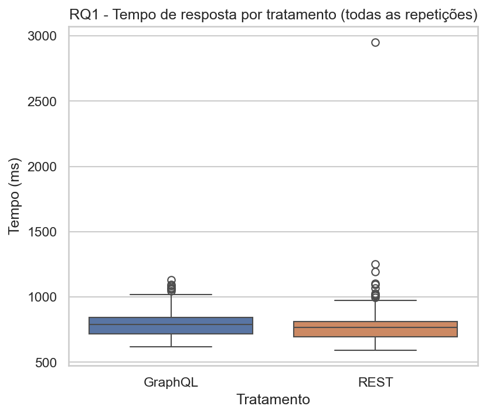

**`rq1_tempo_boxplot_bruto.png`**: boxplot com as 500 medições brutas de cada tratamento (todas as repetições, sem agregar por repositório). As duas caixas (REST e GraphQL) se sobrepõem fortemente: a caixa do REST vai de ~700 a ~830 ms e a do GraphQL de ~755 a ~820 ms, com medianas (linha central) muito próximas. Esse gráfico mostra a variabilidade "bruta", incluindo ruído de rede dentro do mesmo repositório, por isso a diferença real fica menos evidente aqui do que nos gráficos pareados abaixo.

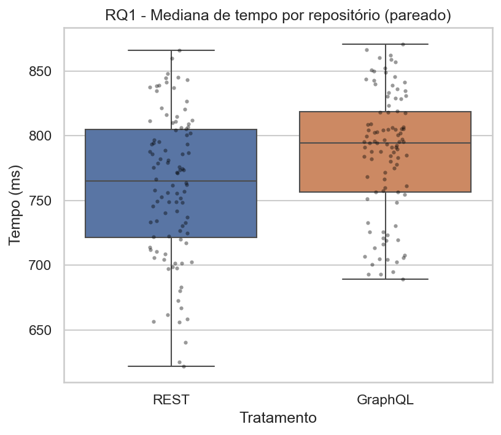

**`rq1_tempo_pareado.png`**: mesmo tipo de boxplot, mas usando a mediana de cada um dos 100 repositórios (a unidade real do teste estatístico) com os pontos individuais sobrepostos. A caixa do GraphQL está visivelmente deslocada para cima da do REST, mas ainda há grande sobreposição, consistente com um efeito real, porém pequeno.

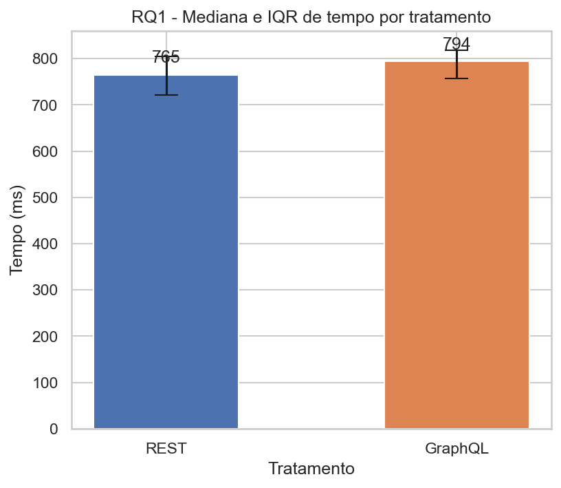

**`rq1_tempo_barras.png`**: gráfico de barras com a mediana de cada tratamento (765 ms vs 794 ms) e barra de erro mostrando o intervalo interquartil (Q1–Q3). É a forma mais direta de comparar os dois números centrais; as barras de erro se sobrepõem bastante, reforçando que a diferença é pequena frente à dispersão entre repositórios.

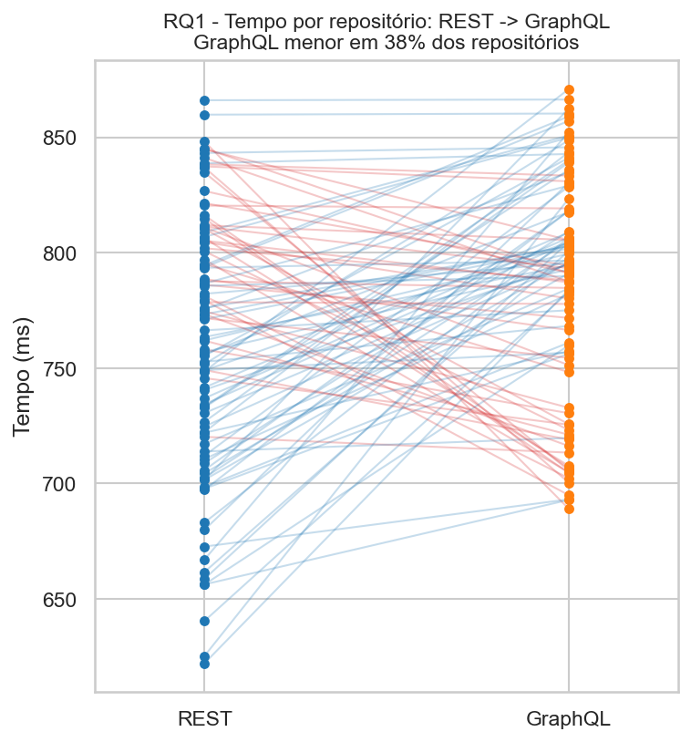

**`rq1_tempo_slope.png`**: gráfico de inclinação ("slopegraph"): uma linha por repositório ligando seu tempo no REST (esquerda) ao tempo no GraphQL (direita); linhas vermelhas indicam que o GraphQL foi mais rápido naquele repositório específico, linhas azuis que foi mais lento. O título indica que o **GraphQL foi mais rápido em apenas 38% dos repositórios**, ou seja, em 62% dos casos individuais o REST venceu. As linhas se cruzam intensamente, sem um padrão visual dominante, o que é a evidência mais clara de que o efeito de RQ1, embora estatisticamente significativo na mediana agregada, **não é um padrão consistente repositório a repositório**.

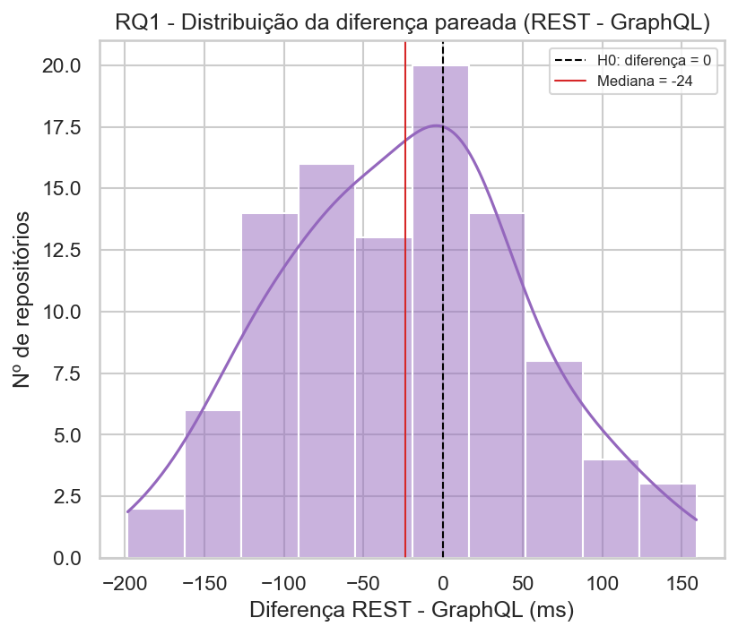

**`rq1_tempo_diferenca.png`**: histograma da diferença pareada (REST − GraphQL) calculada para cada um dos 100 repositórios, com uma linha tracejada em zero (o que H0₁ prevê) e uma linha vermelha na mediana das diferenças (−24 ms). A distribuição é aproximadamente simétrica e bem centrada perto de zero, cruzando-o substancialmente para ambos os lados, exatamente o que se espera de um efeito pequeno (mediana de −24 ms) detectado como significativo só porque o teste pareado usa as 100 observações em conjunto, e não por ser um efeito grande em cada caso individual.

### 5.3 RQ2: Tamanho da Resposta

| | REST | GraphQL |
|---|---|---|
| Mediana (100 repositórios) | 6.321,0 bytes | 431,5 bytes |
| Diferença | GraphQL **93,2% menor** (≈ 14,6× menor) | |

- **Shapiro-Wilk** na diferença pareada: p = 0,04348 (< 0,05) → diferenças **não** seguem distribuição normal.
- Teste escolhido: **Wilcoxon signed-rank** → estatística = 0,0000, **p-valor = 3,9 × 10⁻¹⁸** (≈ 0).
- **H0₂ rejeitada** com a maior margem do experimento: a estatística W = 0 é o menor valor possível do teste, indicando que a direção da diferença é praticamente unânime entre os 100 repositórios.

**Como ler os gráficos do RQ2:**

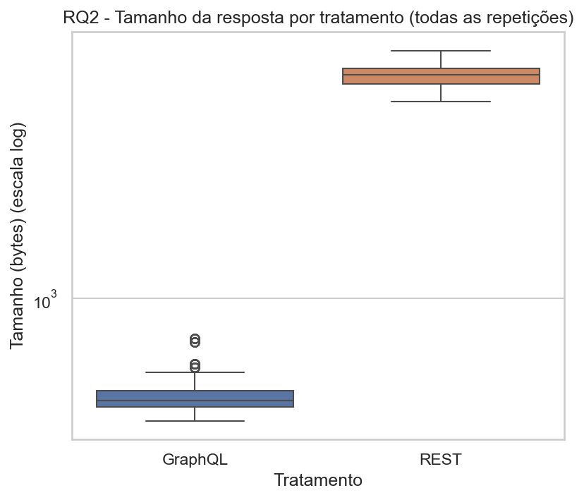

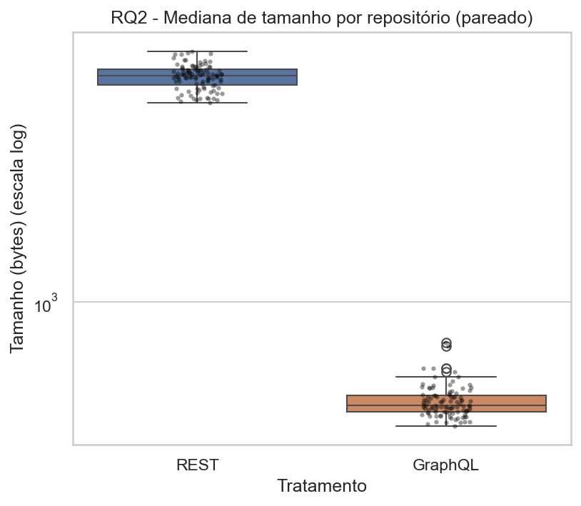

**`rq2_tamanho_boxplot_bruto.png`** e **`rq2_tamanho_pareado.png`**: boxplots (bruto e pareado por repositório) com o **eixo Y em escala logarítmica**. Essa escala é necessária aqui porque o REST (~6.300 bytes de mediana) é cerca de 14,6× maior que o GraphQL (~430 bytes); em escala linear, a caixa do GraphQL ficaria completamente espremida perto do zero, ilegível. Em escala log, ambas as caixas e seus respectivos pontos fora da curva ("outliers", círculos acima/abaixo dos bigodes) ficam visíveis, e a separação total entre as duas caixas (sem qualquer sobreposição) já comunica visualmente a magnitude do efeito antes mesmo de qualquer teste estatístico.

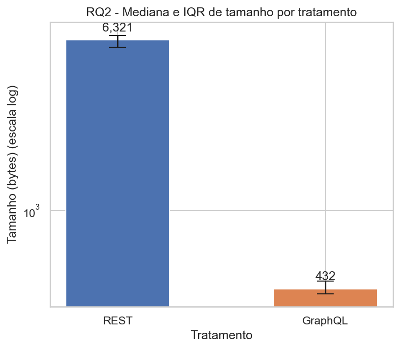

**`rq2_tamanho_barras.png`**: barras com a mediana (6.321 vs 432 bytes, valores anotados acima de cada barra) e intervalo interquartil, também em escala log. A altura visualmente desproporcional entre as barras é a representação mais direta do achado principal do RQ2.

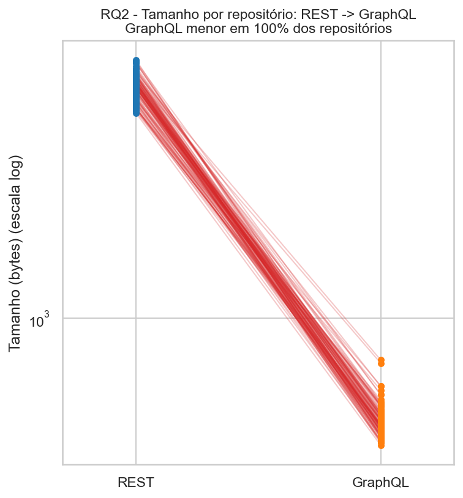

**`rq2_tamanho_slope.png`**: slopegraph equivalente ao do RQ1, também em escala log. Aqui **100% das 100 linhas são vermelhas** (GraphQL menor em todos os repositórios, sem uma única exceção) e praticamente paralelas entre si, convergindo da faixa de 5.000–7.700 bytes (REST) para a faixa de 366–718 bytes (GraphQL). A ausência de qualquer cruzamento de linhas é a evidência visual mais forte de um efeito sistemático e universal na amostra, explicando por que o teste Wilcoxon retornou estatística zero.

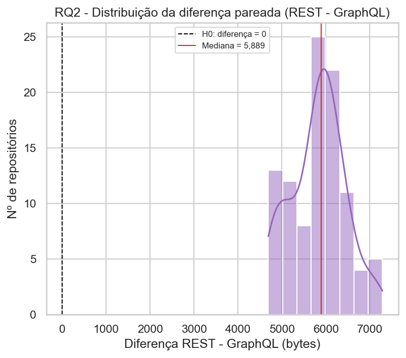

**`rq2_tamanho_diferenca.png`**: histograma da diferença pareada (REST − GraphQL) por repositório. Toda a massa da distribuição está concentrada entre ~4.600 e ~7.300 bytes, **inteiramente à direita da linha de zero (H0₂)**: nenhum repositório tem diferença negativa ou próxima de zero. A mediana das diferenças (5.889 bytes, linha vermelha) resume bem o padrão: o REST praticamente sempre transmite alguns milhares de bytes a mais que o GraphQL para a mesma informação.

### 5.4 Síntese Comparativa

| RQ | Métrica | REST | GraphQL | Diferença | Teste | p-valor | H0 rejeitada? |
|---|---|---|---|---|---|---|---|
| RQ1 | Tempo (mediana) | 764,92 ms | 794,44 ms | GraphQL +3,9% (mais lento) | t pareado | 0,00088 | Sim |
| RQ2 | Tamanho (mediana) | 6.321,0 bytes | 431,5 bytes | GraphQL −93,2% (menor) | Wilcoxon | ≈ 0 | Sim |

Os slopegraphs (Seções 5.2 e 5.3) resumem visualmente a diferença qualitativa entre os dois resultados: o efeito de RQ2 é **consistente em 100% dos repositórios** (sem exceções), enquanto o efeito de RQ1 é **estatisticamente real mas presente em apenas 38% dos repositórios** individualmente: a maioria dos repositórios, isoladamente, favoreceu o REST em tempo, mas a mediana agregada favoreceu o REST por uma margem pequena e a variabilidade entre repositórios é que determina o resultado de cada caso.

## 6. Discussão e Conclusão

**RQ1: Respostas às consultas GraphQL são mais rápidas que respostas às consultas REST?** **Não, nesta amostra elas foram, em mediana, 3,9% mais lentas** (794 ms vs 765 ms), uma diferença estatisticamente significativa (p = 0,00088) mas de pequena magnitude prática: cerca de 24 a 30 ms em respostas que já levam mais de 700 ms, dominadas por latência de rede e não pelo tempo de processamento da consulta em si. O slopegraph do RQ1 reforça essa leitura: o sinal do efeito se inverte em 38% dos repositórios, ou seja, não há uma vantagem de velocidade do GraphQL identificável caso a caso, apenas uma tendência fraca e consistente apenas na agregação estatística. Uma hipótese plausível é que, para uma consulta simples como a usada aqui (busca de um único recurso, sem aninhamento profundo), o overhead de parsing e resolução de uma query GraphQL no servidor anula qualquer ganho de transferir um payload menor; o tempo de resposta acaba dominado pela rede e pelo processamento do lado do GitHub, não pelo volume de dados transmitido.

**RQ2: Respostas às consultas GraphQL têm tamanho menor que respostas às consultas REST?** **Sim, de forma marcante e universal na amostra**: o GraphQL produziu respostas 93,2% menores (431,5 vs 6.321,0 bytes, ~14,6× menos dados) em mediana, com o teste de Wilcoxon retornando a estatística mínima possível (W = 0). Todos os 100 repositórios tiveram resposta GraphQL menor que a REST, sem exceção. Esse resultado confirma a expectativa teórica da Seção 1.4 e ilustra exatamente o mecanismo por trás dela: como discutido na ameaça à validade de constructo (Seção 2.7), a API REST do GitHub não permite seleção de campos, retornando sempre o recurso completo (mais de 100 campos), enquanto a consulta GraphQL pediu apenas os 10 campos necessários. O resultado, portanto, não mede apenas "GraphQL vs. REST" como tecnologias abstratas, e sim o ganho concreto que um cliente real obtém ao adotar GraphQL **especificamente para evitar over-fetching**, que é o argumento mais comum a favor da tecnologia na prática.

**Conclusão geral**: os dois RQs, juntos, sugerem um trade-off relevante para quem está decidindo entre REST e GraphQL: a economia de **tamanho de payload é grande, consistente e estatisticamente robusta**, mas isso **não se traduziu em ganho de tempo de resposta** neste experimento. Pelo contrário, houve uma pequena perda de tempo, possivelmente compensada em cenários com payloads muito maiores, conexões mais lentas (onde o tamanho do payload pesa mais no tempo total) ou consultas que precisariam de múltiplas chamadas REST para reunir os mesmos dados (under-fetching, não testado neste experimento). Os resultados são específicos da API do GitHub e de uma consulta de leitura simples (Seção 2.7); generalizações para outras APIs, operações de escrita ou consultas GraphQL mais profundas (múltiplos níveis de aninhamento) exigiriam um novo experimento.

## 7. Dashboard de Visualização (Passo 6)

A partir dos dados em `data/resultados_brutos.csv` e `data/resumo_estatistico.csv` e dos 10 gráficos individuais gerados na Seção 5, `scripts/dashboard.py` (Pandas para a leitura e agregação dos dados, Pillow para a composição visual) monta um único painel consolidado, salvo em `imgs/dashboard.png`.

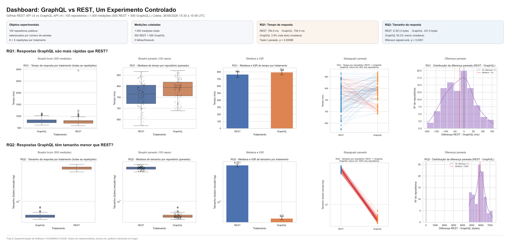

O dashboard reúne:

- **Cabeçalho**: título, e um resumo do ambiente do experimento (APIs comparadas, número de repositórios, total de medições, janela de tempo da coleta).
- **Quatro cartões de resumo**: objetos experimentais (100 repositórios, K = 5 repetições), medições coletadas (1.000 medições, 0 falhas), e um cartão para cada RQ com a mediana de cada tratamento, a diferença relativa e o teste estatístico com seu p-valor.
- **Duas linhas de gráficos**, uma por RQ, reaproveitando os 5 gráficos já gerados na Seção 5 (boxplot bruto, boxplot pareado, barras com IQR, slopegraph e histograma da diferença) lado a lado, permitindo comparar visualmente a consistência do efeito de RQ1 (fraco, presente em 38% dos repositórios) com a de RQ2 (forte e universal, presente em 100% dos repositórios) em uma única tela.

Para reproduzir: `python scripts/dashboard.py --data data --imgs imgs --output imgs/dashboard.png` (requer `pip install pillow`, além das dependências já usadas nas etapas anteriores).
